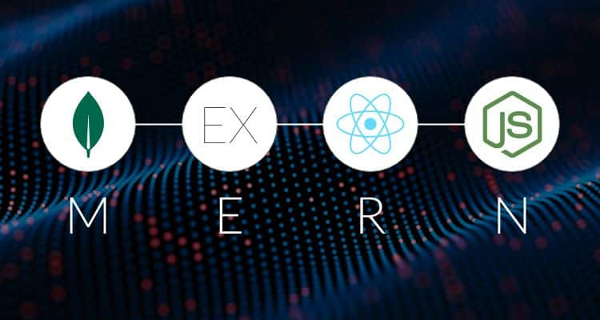

# FaceBook
 A simple facebook clone to learn the basics of MERN 
 
 
 
 Just clone it use npm run dev on Backend and npm start on frontend
 
 Technologies used:
 
 Node.js
 
 Express
 
 Typescript
 
 Mongoose - Helps in working with MongoDB
 
 Bcrypt - Used for hashing password
 
 Redux Toolkit - Helps in working with redux
 
 React.js with Typescript
 
 Nodeman - Used for development
 
 MongoDB - Main database
 
 React Bootstrap - A library helps in creating UI elements.
 
 React Stories - A library helps in creating whatsapp like status
 
 Google Icon - Used for icon
 
 Axios - A library used for making HTTP request
 
 JsonWebToken - A library used for creating tokens for authentication and authorization
 
 Multer - A library used for image and video uploading
